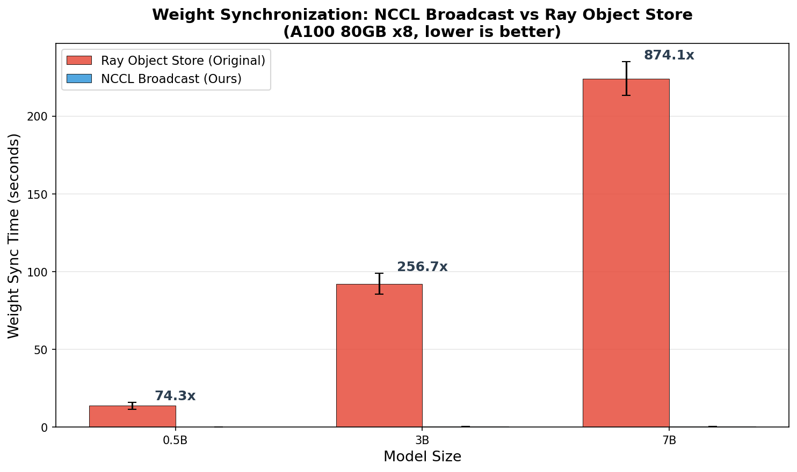
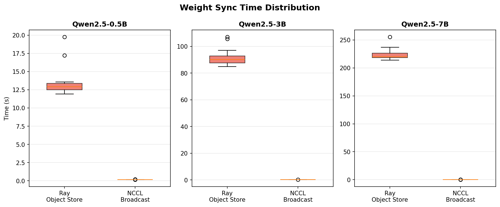

# Weight Synchronization Benchmark: NCCL Broadcast vs Ray Object Store

## Overview

This benchmark compares the **weight synchronization time** between two approaches in the async-GRPO (Group Relative Policy Optimization) training pipeline:

| | Original async-grpo | async-grpo-nccl (Ours) |
|---|---|---|
| **Mechanism** | Ray Object Store (`ray.put` / `ray.get`) | NCCL Broadcast (`ray.util.collective.broadcast`) |
| **Data Path** | GPU → CPU → Object Store → CPU → GPU | GPU → GPU (direct) |
| **Serialization** | CPU offload + pickle serialization | None (in-place GPU transfer) |

Weight synchronization occurs after every `optimizer.step()` — updated model weights from the trainer must be distributed to the generation and log-probability workers so they can use the latest policy for sampling and scoring.

## Results

### Summary Table

| Model | Ray Object Store | NCCL Broadcast | Speedup |
|-------|-----------------|----------------|---------|
| Qwen2.5-0.5B | 13.69s ± 2.15s | 0.18s ± 0.01s | **74.3x** |
| Qwen2.5-3B | 92.12s ± 6.80s | 0.36s ± 0.01s | **256.7x** |
| Qwen2.5-7B | 224.06s ± 10.88s | 0.26s ± 0.003s | **874.1x** |

*Each measurement is the mean ± std of 13 weight synchronization events.*

### Bar Chart



### Distribution (Box Plot)



## Analysis

**Ray Object Store** scales poorly with model size. The transfer path involves GPU → CPU memory copy, serialization into Ray's shared-memory Object Store, and then deserialization + CPU → GPU copy on each worker. For a 7B parameter model (~14GB in bf16), this round-trip takes over **3.7 minutes per sync**.

**NCCL Broadcast** remains nearly constant regardless of model size (0.18s–0.36s). NCCL operates directly over NVLink/PCIe between GPUs, avoiding CPU offload and serialization entirely. The sub-second sync time means weight distribution is no longer a bottleneck in the training loop.

The speedup grows with model size: **74x at 0.5B → 257x at 3B → 874x at 7B**. This is because Ray Object Store time scales linearly with parameter count (more data to serialize and copy through CPU), while NCCL broadcast time stays flat (GPU-to-GPU bandwidth is constant and vastly higher than the CPU-mediated path).

## Experimental Setup

### Hardware

- **Instance**: GCP `a2-ultragpu-8g`
- **GPUs**: 8x NVIDIA A100 80GB SXM4
- **Interconnect**: NVLink (600 GB/s bidirectional between GPUs)

### Software

| | async-grpo-nccl | Original async-grpo |
|---|---|---|
| **Ray** | 2.47.1 | 2.40.0 |
| **vLLM** | 0.8.5 | 0.7.3 |
| **PyTorch** | 2.7+ | 2.7+ |
| **FSDP** | FSDP2 (`fully_shard`) | FSDP2 (`fully_shard`) |

### Training Configuration

| Parameter | Value |
|-----------|-------|
| Dataset | countdown (200 samples) |
| Batch size | 16 |
| Samples per question | 4 |
| Max generation tokens | 128 |
| Training batches | 13 |
| Max tokens per GPU | 4000 |
| Learning rate | 1e-6 |
| Reward function | countdown |

### GPU Allocation

| Model | Trainer GPUs | Generation GPUs | LogProb GPUs | Total |
|-------|-------------|----------------|-------------|-------|
| 0.5B | 1 | 1 | 1 | 3 |
| 3B | 1 | 1 | 1 | 3 |
| 7B | 2 | 1 | 1 | 4 |

### Measurement Points

Both implementations measure weight sync time at the same logical point — **after `optimizer.step()` completes** (i.e., after the gradient step, when the trainer has updated weights ready to distribute):

- **NCCL**: Instrumented in `orchestrator.py` around `sync_all_weights()`, which calls `ray.util.collective.broadcast()`.
- **Original**: Built-in logging in `trainer_core.py` around `update_vllm_worker_weights()`, which calls `ray.put()` + `ray.get()` to push weights through the Object Store.

## How to Reproduce

### Prerequisites

- GCP account with A100 GPU quota (or equivalent multi-GPU setup)
- `gcloud` CLI installed and authenticated
- This repository cloned locally

### Option 1: Automated (recommended)

```bash
# Full run: creates instance, sets up environment, runs benchmark
bash benchmark/launch_benchmark.sh --attach

# Or with existing instance:
bash benchmark/launch_benchmark.sh --reuse_instance <name> --skip_setup --attach

# Specific models only:
bash benchmark/launch_benchmark.sh --models "0.5B 3B"
```

### Option 2: Manual

**1. Set up the GCP instance:**

```bash
# Create instance (a2-ultragpu-8g = 8x A100 80GB)
gcloud compute instances create weight-sync-bench \
    --zone=us-east4-c \
    --machine-type=a2-ultragpu-8g \
    --image-family=pytorch-2-7-cu128-ubuntu-2204-nvidia-570 \
    --image-project=deeplearning-platform-release \
    --boot-disk-size=500GB \
    --boot-disk-type=pd-ssd
```

**2. Upload code and set up environment:**

```bash
# Upload this project
gcloud compute scp --recurse ./async-grpo-nccl <instance>:~/

# SSH in and run setup
gcloud compute ssh <instance>
bash ~/async-grpo-nccl/benchmark/remote_setup.sh
```

The setup script:
- Clones the original [async-grpo](https://github.com/Red-Hat-AI-Innovation-Team/async-grpo) repository
- Creates two Python venvs (`venv_nccl` with Ray 2.47.1, `venv_original` with Ray 2.40.0)
- Patches the original code for compatibility (runtime_env fix, ZeroDivisionError fix)
- Prepares the benchmark dataset (200-sample subset)

**3. Run the benchmark:**

```bash
# Run all models (detached, survives SSH disconnect)
nohup bash ~/async-grpo-nccl/benchmark/remote_run_benchmark.sh 0.5B 3B 7B \
    > ~/benchmark_results/benchmark.log 2>&1 &

# Monitor progress
tail -f ~/benchmark_results/master_progress.log
```

**4. Download results and generate plots:**

```bash
# From local machine
gcloud compute scp --recurse <instance>:~/benchmark_results/ ./benchmark/results/
python benchmark/collect_and_plot.py ./benchmark/results/
```

### Important Notes

- The two venvs use **different Ray versions** (2.40.0 vs 2.47.1). The benchmark script performs aggressive cleanup (`hard_cleanup`) between runs to prevent version conflicts.
- For the original async-grpo, **GPU isolation** is critical: Ray must only manage GPUs for generation and logprob workers, while the trainer runs on separate GPUs via `CUDA_VISIBLE_DEVICES`. Without this, Ray and torchrun will conflict over GPU resources.
- `VLLM_USE_V1=1` is required for async-grpo-nccl (uses vLLM's AsyncLLM), while `VLLM_USE_V1=0` is required for the original (vllm 0.7.3 doesn't support V1).

## File Structure

```
benchmark/
├── RESULTS.md                   # This document
├── weight_sync_comparison.png   # Bar chart
├── weight_sync_boxplot.png      # Box plot
├── results.json                 # Parsed results (mean, std, speedup)
├── launch_benchmark.sh          # Main entry point (local → GCP)
├── remote_setup.sh              # Environment setup (runs on GCP)
├── remote_run_benchmark.sh      # Benchmark runner (runs on GCP)
├── collect_and_plot.py          # Log parser + chart generator (local)
├── configs/                     # NCCL orchestrator configs per model size
│   ├── nccl_0.5b.json
│   ├── nccl_3b.json
│   ├── nccl_7b.json
│   └── nccl_14b.json
└── results/                     # Raw logs (gitignored)
    ├── nccl_0.5B.log
    ├── nccl_3B.log
    ├── nccl_7B.log
    ├── original_0.5B.log
    ├── original_3B.log
    └── original_7B.log
```
